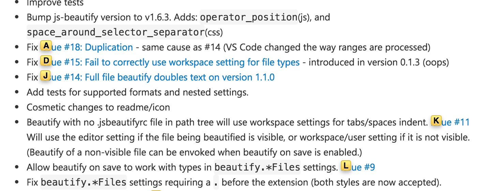
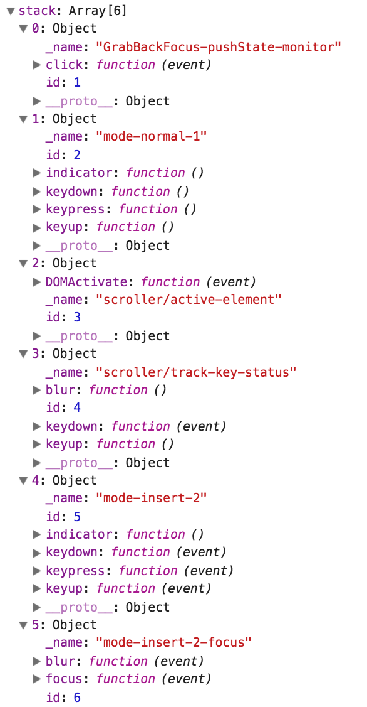
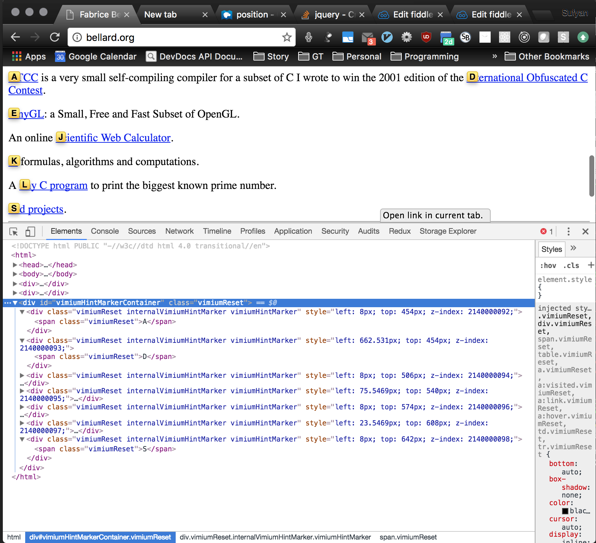

Figure out schedulung settimeout javascrit

A forray into Chrome Extensions: Vimium

Do you use Vim? I don't. On the rare occasion that another terminal program launches Vim, I struggle to figure out why my keyboard isn't responding as expected. Then I realize, "Oh! it's vim! :q."

I do, however, use Vimium, a chrome extension inspired by Vim that enables seemless WWW navigation using just your keyboard. No mouse needed! It provides the following (and more):

1. Keyboard shortcuts for tab manipulation
  * switching tabs
  * closing tabs
  * moving tabs

2. Keyboard shortcuts for navigating a page
  * scrolling up and down
  * scrolling to the top or bottom
  * following 'previous page', 'next page' links
  * going Up in the URL hierachy, e.g. /animals/cats -> /animals
  * going back or forward in history

3. Keyboard shortcuts for activating modes and menus
  * LinkHints Mode - attaches strings to links and inputs that activate the attached element when typed (see 4 if you don't understand)
  * Insert Mode - disables commands, passing key events directly to the page, so you can type text in peace
  * Visual Mode - focuses on each input and link of a page one at a time, switching with tab
  * Find Mode - powerful ctl-F search replacement
  * Help menu - shows commands and their keyboard mappings
  * Vomnibar - powerful URL bar replacement

4) Link hints that attach a string to every link and input element such that typing an element's unique string activates it. Link hints are what truly separate Vimium from a dumb key-executes-command extension. This snippet from a web page shows link hints on each link. 



Remove any one of these four features, and a keyboard-only broswing experience just wouldn't work. There are other features I haven't mentioned, but I believe these are nice to have but nonessential.

---
Overall Vimium provides a viable natural replacement for the typical input. But then, I thought, "Using just your keyboard to navigate the web is marvelous. Why doesn't an extension for navigating the web with just your voice exist?"

It's not that none exists. See [Voice Actions For Chrome](https://chrome.google.com/webstore/detail/hhpjefokaphndbbidpehikcjhldaklje) for instance. It's that they don't provide a navigation mechanism analagous to Vimium's link hints. Sure you can do a Google search by saying "Google cats," but once you arrive at the search results page, you're forced to use your mouse to click the link of interest.

And so, my quest to implement a natural voice interface to the web began.

---

At this stage, I knew had an idea, and was faced with solving one of the 3 hardest problems a developer can encounter: giving my idea a name. VWN. Short for Voice Web Navigation. Boring, but oh well.

Next step was implementation. How do you start? I decided to develop VWN as a fork of Vimium so I could save myself effort by reusing existing code. Isn't open-source great? Vimium itself is an MIT-licensed project hosted on github with several thousand commits over several years. A short git clone away, and the hacking began.

Much to my dismay, I discovered Vimium is written in coffeescript, an early entrant in the array of languages that compile to javascript. It really isn't all that different from javascript except that it uses whitespace instead of braces, implictly adds return statements in ways I don't fully understand, and provides nice features like comprehensions and null-checked property accesses. Learning that Vimium is implemented in a language I never used before gave me second thoughts about using it as the base for VWN, but I ultimately decided the benefits of code reuse overruled the cost of learning a new language.

---

Now, I was staring at the Vimium code base trying to peice together how things work, but it just wasn't making any sense. I realized that learning how chrome extensions work in general would be a more prudent first step. So, I spent a day staring at the official Chrome extensions documentation. It turns out that a chrome extension comprises:
1. content scripts that are loaded into each page
2. a background page for persistence and privileged actions
3. regular html pages the user can navigate to
4. a manifest file declaring the extension's content and permissions

The manifest file allows you to specify both content scripts and the URLs for which they are loaded. ...

As I peiced together the basic architecture of a chrome extension, I began to theorize how Vimium works. A content script loaded into every page adds key event listeners. When a key is pressed, the key listener checks the keycode and executes the corresponding action. Sometimes the action requires privileges beyond what is available to content scripts. In this case, the content script sends a message to the background script, and the background script executes the action. Users can specify the command mapped to each key using the options page, which saves the mappings to chrome's local storage. Every time a page is loaded, the content script queries chrome's local storage to pull the mappings. 

My mental model wasn't too far from the truth, but it really missed some crucial details. And here's where I get into the nitty gritty details of Vimium

---

I'll start from the bottom up.

A content script is loaded into every page that adds key event listeners. These listeners are installed before the document is loaded so that they take precedence over any listeners loaded by a particular page. Notice that Vimium listens for more than just key events. It cares for click, focus, blur, mousedown, and scroll events. It also listen for the the document to activate.

```coffee
installListeners = Utils.makeIdempotent ->
  for type in ["keydown", "keypress", "keyup", "click", "focus", "blur", "mousedown", "scroll"]
    do (type) -> installListener window, type, (event) -> handlerStack.bubbleEvent type, event
  installListener document, "DOMActivate", (event) -> handlerStack.bubbleEvent 'DOMActivate', event
```

Before installing the event listeners, Vimium checks to see if it should be enabled for that particular URL.

```coffee
installListener = (element, event, callback) ->
  element.addEventListener(event, ->
    if isEnabledForUrl then callback.apply(this, arguments) else true
  , true)
```

The important thing to notice is that by default all events are passed to a handler stack. What's a handler stack? As it's name implies, it's a stack of handlers that respond to events. Each handler is itself composed of multiple subhandlers, one for each type of event that the handler responds to. When an event is passed to the handler stack, it checks if the handler at the top of the stack is valid and has a subhandler for the passed event type. If either check fails, the next handler is checked. Otherwise, the subhandler for the passed even type is called. The subhandler return value determines which of the following to do next:
* @continueBubbling: bubble the event to the next handler
* @passEventToPage: stop bubbling and pass the event to the page
* @suppressPropagation: stop handler stack processing and event propogation
* @suppressEvent: stop handler stack processing, stop event propogation and prevent the default behavior
* @restartBubbling: restart bubbling from the top of the stack, typically because a new handler has been pushed onto the stack

Learn about web event [propagation](https://codeplanet.io/preventdefault-vs-stoppropagation-vs-stopimmediatepropagation/) and [suppression](http://www.quirksmode.org/js/events_order.html). Below is slightly modified snippet of Vimium's bubbleEvent code.

```coffee
  bubbleEvent: (type, event) ->
    @eventNumber += 1
    eventNumber = @eventNumber
    for handler in @stack[..].reverse()
      unless handler?.id and handler[type]
      else
        @currentId = handler.id
        result = handler[type].call this, event
        if result == @passEventToPage
          return true
        else if result == @suppressPropagation
          event.stopImmediatePropagation()
          return false
        else if result == @restartBubbling
          return @bubbleEvent type, event
        else if result == @continueBubbling or (result and result != @suppressEvent)
          true # Do nothing, but continue bubbling.
        else # result is @suppressEvent or falsy.
          if event?.preventDefault? or event?.stopImmediatePropagation? event
            event.preventDefault()
            event.stopImmediatePropagation()
          return false
```

---

The next question then is, what exactly does the subhandler handler do? It depends. Let's follow one possible code path corresponding to the user pressing 'j' to scroll down.

Vimium has various types of 'Modes', which inherit from a parent Mode class. Creating a new instance of a Mode class roughly corresponds to creating a new handler and pushing it onto the handler stack. Creating an instance of a class that extends Mode is a convenient way to create a custom handler. Any time an instance of a mode is created, it's constructor automatically pushes it onto the handler stack. Calling exit() on a mode object removes it from the handler stack. A mode can also specify an indicator in the HUD to be displayed. Note that there are custom handlers that don't extend Mode and are created and added to the handler stack manually.

A few modes are installed permanently

* NormalMode - handles key input for standard commands
* 
* InsertMode - tracks focus changes and  passes key input directly to page skipping other handlers when enabled (you can specify which keys should be deactivated on particular pages)
* GrabBackFocus - reclaims focus from an the default input on page loads

Here is the handler stack at the time j is pressed, right before the handler is called using `result = handler[type].call this, event`in the bubbleEvent function:



Pressing and releasing the 'j' key results in the following events in this order: keydown, keypress, keyup. All three of these events, starting with keydown, are bubbled to the handler stack for processing. For each event, each handler is checked one by one until propagation stops or no more handlers are available, as follows:


__1. keydown__

1. Handler mode-insert-2-focus, doesn't listen for key events, so it is skipped.
2. Handler mode-insert-2 listens for key events, and its keydown handler is called, but because insert mode isn't active, it returns continueBubbling, and the next handler is checked.
3. Handler scroller/track-key-status increments a time variable on any keyup, keydown, or blur event. This is needed because sometimes a keyup isn't detected after a keydown, resulting in scrolling infinitely. So the time is checked on scrolling to make sure it matches up with the scroll activation time. Once it increments the time, records the fact that a key is down, and records the key event, it returns continueBubbling, so the next handler is checked.
4. Handler scroller/active-element keeps track of the activated element, but has no keydown handler, so it is skipped.
5. Handler mode-normal-1, stores the pressed key 'j' in a dictionary of keyDownEvents, then returns suppressesPropagation. Thus, handlerStack processing of the keydown event finishes.

__2. keypress__

1. Handler mode-insert-2-focus doesn't listen for key events, so it is skipped.
2. Insert mode still isn't active, so Handler mode-insert-2 once againt returns continueBubbling, and the next handler is checked.
3. Handler scroller/track-key-status handles only keydown and keyup events, not keypress events, so it is skipped.
4. Handler scroller/active-element has no keypress handler, so it is skipped.
5. Handler mode-normal-1 sees the keypress event and calls the handleKeyChar function, which finds the command Object mapped to the particular key pressed. In this case, the 'scrollDown' command is mapped to key 'j'.  Next, it calls the commandHandler function, passing the the ScrollDown command. The commandHandler function observes the command then does one of 3 things.
    1.  In the simplest case, the content script directly executes the command.
    2.  Sometimes the command requires privileges not available to content scripts (like tab manipulation), so it sends a message to the background page requesting it to execute the command.
    3. Sometimes the command must be executed within the top frame of a page. Because child frames are sandboxed to their own properties, they sidestep this restriction by sending a command to the background page, which turns around and sends the command right back to the source tab. All frames within a tab receive the message, but only the top frame will execute the command.
```coffee
  commandHandler: (command) ->
    if command.topFrame
      chrome.runtime.sendMessage
        handler: "sendMessageToFrames"
        message: {name: "runInTopFrame", sourceFrameId, command}
    else if command.background
      chrome.runtime.sendMessage
        handler: "runBackgroundCommand"
        command: command
    else
      executeCommand(command)
```
5. (continued) The 'scrollDown' command triggers the simple codepath in which the command is directly executed. The scrollDown() function is executed and the page is scrolled down by one step. At this stage, the handler returns suppressesPropagation. Thus, handlerStack processing of the keypress event finishes.

__3. keypress__

At this stage the scrollDown action has been executed, but the handlers still process the keyup event.

1. Handler mode-insert-2-focus doesn't listen for key events, so it is skipped.
2. Insert mode still isn't active, so Handler mode-insert-2 once againt returns continueBubbling, and the next handler is checked.
3. Handler scroller/track-key-status increments the time, records the fact that the last event was a key release, then returns continueBubbling, so the next handler is checked.
4. Handler scroller/active-element has no keyup handler, so it is skipped.
5. Handler mode-normal-1, removes the pressed key 'j' from the dictionary of keyDownEvents, then returns suppressesPropagation. Thus, handlerStack processing of the keyup event finishes.

And thus processing is done and the page is scrolled down. That's an awful lot of work for one simple command.

# Link Hints

So, that's how scrolling works. Now, how do link hints work? It's a mess.

A web page may comprise multiple frames, and the content script is independently loaded into every frame of a page. The first thing the content script does after installing event listeners is create and initialize a Frame object.

```coffee
initializePreDomReady = ->
  installListeners()
  Frame.init()
  checkIfEnabledForUrl document.hasFocus()
```

On initialization, a Frame sends a message to the background page to register itself and establish a port for further communication. When a command message from the background page is received on this port, the frame executes the commands in its context. If a frame is closed or the user navigates to a new URL, it sends a message to the background page to unregister itself.

```coffee
  Frame.init = ->
    @port = chrome.runtime.connect name: "frames"
    @port.onMessage.addListener (request) => (this[request.handler]) request
    window.addEventListener "unload", disconnect
  
  Frame.registerFrameId = ({chromeFrameId}) ->
    frameId = window.frameId = chromeFrameId
    Frame.postMessage "registerFrame"
```
The background page listens for connections requests from pages. The background page keeps track of the frames for each tab and the port associated with each frame (albeit in a convoluted way). When the background page establishes a connection to a frame, it informs the frame of its frameId by sending back a message containing the requesting frame's frameId (which it obtains via port.sender.frameId). 

```coffee
chrome.runtime.onConnect.addListener (port) ->
  if (portHandlers[port.name])
    port.onMessage.addListener portHandlers[port.name] port.sender, port

# portHandlers return callbacks bound to port message listeners
# The frames handler, which is returned by Frames.onConnect, is used for both frame messages and linkhints messages
portHandlers =
  completions: handleCompletions
  frames: Frames.onConnect.bind Frames

Frames.onConnect = (sender, port) ->
  [tabId, frameId] = [sender.tab.id, sender.frameId]
  port.onDisconnect.addListener -> Frames.unregisterFrame {tabId, frameId}
  port.postMessage handler: "registerFrameId", chromeFrameId: frameId
  (request, port) => this[request.handler] {request, tabId, frameId, port}

Frames.registerFrame: ({tabId, frameId, port}) ->
    frameIdsForTab[tabId].push frameId unless frameId in frameIdsForTab[tabId] ?= []
    (portsForTab[tabId] ?= {})[frameId] = port

Frame.unregisterFrame = ({tabId, frameId}) ->
    # FrameId 0 is the top/main frame.  We never unregister that frame.  If the tab is closing, then we tidy
    # up elsewhere.  If the tab is navigating to a new page, then a new top frame will be along soon.
    # This mitigates against the unregister and register messages arriving out of order. See #2125.
    if 0 < frameId
      if tabId of frameIdsForTab
        frameIdsForTab[tabId] = (fId for fId in frameIdsForTab[tabId] when fId != frameId)
      if tabId of portsForTab
        delete portsForTab[tabId][frameId]
    HintCoordinator.unregisterFrame tabId, frameId
```

1. User loads new page (which for simplicity contains no subframe)
2. Frame establishes connection to background page through a port named 'frames'
3. Background page responds to new connection by adding onMessage and onDisconnect listener to the new port
4. Background page then sends 'registerFrameId' message containing the frame's frameId back to the frame
5. Frame receives the message and records its frameId
6. Frame sends a 'registerFrame' message back to background page
7. Background page stores the new frame and its port

Summary: Frame -> Background -> Frame -> Background

1. User clicks 'x' to close the tab
2. Frame detects unload event and calls disconnect, which attempts to 1) send an "unregisterFrame" message to the background page and 2) disconnect the port. 
3. Backgroundpage gets "unregisterFrame" message or port disconnect event, then unregisters the frame removing the frame and its port from storage. Note that the top frame's port and frameId are never removed (to prevent unregister/register misorder bug on new page loads). The top frame is only cleaned up when a tab is closed by the `chrome.tabs.onRemoved.addListener` listener.

```coffee
  disconnect: ->
    try @postMessage "unregisterFrame"
    try @port.disconnect()
    @postMessage = @disconnect = ->
    @port = null
    @listeners = {}
    HintCoordinator.exit isSuccess: false
    handlerStack.reset()
    isEnabledForUrl = false
    window.removeEventListener "focus", onFocus
    window.removeEventListener "hashchange", onFocus
```

# Hints

Alphabet Hints - assign alpha chars to links
Filter Hints - assign numbers to links and filter by text

So, how do link hints work? Before I get into the details, know that it involves back and fourth messages between the content script and background page, and communication is facilitated by unrelated  HintCoordinator objects. The background page HintCoordinator has completely different methods from the content script Hint Coordinator.

You start with a keypress. This gets handled by the normal-mode-1 handler (i'll skip the detailed steps this time around), which invokes the LinkHints.activateMode() command.

1. LinkHints.activateMode calls HintCoordinator.prepareToActivateMode, which suppresses keyboard events until link-hints mode is activated, then sends a "linkHintsMessage" of type "prepareToActivateMode" to the background page (on the same port established when the frame is created).

```coffee
# content script

LinkHints.activateMode = (mode = OPEN_IN_CURRENT_TAB) ->
    HintCoordinator.prepareToActivateMode mode

HintCoordinator.prepareToActivateMode = (mode) ->
    installSuppressAllKeyboardEventsHandler()
    @sendMessage "prepareToActivateMode", {modeIndex: availableModes.indexOf(mode)}

HintsCoordinator.sendMessage = (messageType, request = {}) ->
    Frame.postMessage "linkHintsMessage", extend request, {messageType}
```

2. The background page handles the message with the Frames.linkHintsMessage handler, which calls HintCoordinator.onMessage, which calls the HintCoordinator.prepareToActivateMode handler, which collects tab state information (ports, frames, hintDescriptors, originating Frame Id, mode index) then sends a "linkHintsMessage" of type "getHintDescriptors" to every frame of the originating tab.

```coffee
# background script

linkHintsMessage: ({request, tabId, frameId}) ->
  HintCoordinator.onMessage tabId, frameId, request

HintCoordinator.onMessage = (tabId, frameId, request) ->
  this[request.messageType] tabId, frameId, request

HintCoordinator.prepareToActivateMode = (tabId, originatingFrameId, {modeIndex}) ->
    @tabState[tabId] = {frameIds: frameIdsForTab[tabId][..], hintDescriptors: {}, originatingFrameId, modeIndex}
    @tabState[tabId].ports = extend {}, portsForTab[tabId]
    @sendMessage "getHintDescriptors", tabId, {modeIndex}

HintCoordinator.sendMessage: (messageType, tabId, request = {}) ->
    for own frameId, port of @tabState[tabId].ports
      @postMessage tabId, parseInt(frameId), messageType, port, request

HintCoordinator.postMessage: (tabId, frameId, messageType, port, request = {}) ->
    port.postMessage extend request, {handler: "linkHintsMessage", messageType}
```

3. Each frame handles the message with HintCoordinator.getHintDescriptors. This gets all hint descriptors (which is a complicated process discussed in a later section). Once they're obtained, each frame sends a "linkHintsMessage" message of type "postHintDescriptors" to the background page. 

```coffee
# content script

HintCoordinator.getHintDescriptors = ({modeIndex}) ->
  DomUtils.documentReady => Settings.onLoaded =>
    requireHref = availableModes[modeIndex] in [COPY_LINK_URL, OPEN_INCOGNITO]
    @localHints = LocalHints.getLocalHints requireHref
    @localHintDescriptors = @localHints.map ({linkText}, localIndex) -> {frameId, localIndex, linkText}
    @sendMessage "postHintDescriptors", hintDescriptors: @localHintDescriptors
```

4. The background page receives, then stores, the hint descriptors from every frame. Once every frame has sent its hint descriptors, the background page sends each frame every other frame's hint descriptors, but not the frame's own hintDescriptors. This seems pointless, but it improves performance.

```coffee
# background page

HintCoordinator.postHintDescriptors = (tabId, frameId, {hintDescriptors}) ->
  if frameId in @tabState[tabId].frameIds
    @tabState[tabId].hintDescriptors[frameId] = hintDescriptors
    @tabState[tabId].frameIds = @tabState[tabId].frameIds.filter (fId) -> fId != frameId
    # don't execute the following unless this is the final frame message
    if @tabState[tabId].frameIds.length == 0
      # send every frame every other frame's hint descriptors, but not its own hint descriptors
      for own frameId, port of @tabState[tabId].ports
        if frameId of @tabState[tabId].hintDescriptors
          hintDescriptors = extend {}, @tabState[tabId].hintDescriptors
          delete hintDescriptors[frameId]
          @postMessage tabId, parseInt(frameId), "activateMode", port,
            originatingFrameId: @tabState[tabId].originatingFrameId
            hintDescriptors: hintDescriptors
            modeIndex: @tabState[tabId].modeIndex
```

5. Each frame then receives a message containing every other frame's hint descriptors. It combines its own hint descriptors with the received hint descriptors to create a complete set of hint descriptors. After it checks to make sure that document is ready and settings have been loaded, it removes the previously installed keyboard suppresion handler and activates LinkHints mode, by creating a new LinkHintsMode Mode and passing the hint descriptors and mode. 

```coffee

  # We also propagate the key state between frames.  The hint-selection process proceeds in lock
  # step in every frame, and @linkHintsMode is in the same state in every frame.
  activateMode: ({hintDescriptors, modeIndex, originatingFrameId}) ->
    # merge frame's hint descriptors with the hint descriptors from the background page
    [hintDescriptors[frameId], @localHintDescriptors] = [@localHintDescriptors, null]
    hintDescriptors = [].concat (hintDescriptors[fId] for fId in (fId for own fId of hintDescriptors).sort())...
    # Ensure that the document is ready and that the settings are loaded.
    DomUtils.documentReady => Settings.onLoaded =>
      removeSuppressAllKeyboardEventsHandler() if @suppressKeyboardEvents?.modeIsActive
      @linkHintsMode = new LinkHintsMode hintDescriptors, availableModes[modeIndex]
```

0. user presses 'f'
1. c[active frame]->b: prepareToActivateMode(modeIndex)
2. b: collect tabstate = tabID indexed dict of {framesIdsForTab, portIdsForTab, hintDescriptors={}, originatingFrameId, mode}
3. b->c[each frame]: getHintDescriptors(tabId, frameId, port, modeIndex)
4. c: collects hint descriptors
5. c[each frame]->b: postHintDescriptors(frame's own hintDescriptors)
6. b: combines hintDescriptors from all frames
7. b->c[each frame]: activateMode(port, originatingFrameId, every other frame's hintDescriptors, modeIndex)
8. c: activates new link hints mode with hint descriptors and specified mode (new tab, cur tab, etc.)

HintDescriptor =
  frameId: frame id of hint's local frame
  localIndex: the index into the Frame's @localHints object for full details of hint
  linkText: linkText (for filtered Hints, null for alphabet hints)

# Link Hints Mode

So, now what happens once link hints mode is activated? The user expects link hints associated with each link/input to appear on screen. But how does it happen?

You might suspect that Vimium adds each link hint as a child of the element it is associated with. If so, you suspected wrong. Although this seems like the most straightforward strategy, I __conjecture__ they opted not to because 1) manipulating the DOM is slow and 2) it is invalid and nonsensical to append children to HTML elements like <input>.

Vimium actually appends a "vimiumHintMarkerContainer" div to the document's root <html> element. Each link hint is then added as an absolute-positioned child to this "vimiumHintMarkerContainer." Each link hint has a custom style specifying its position and z-index and a child span containing the actual text of the link hint. 



When a user exits Link Hints mode, for example by pressing escape or clicking on screen, the "vimiumHIntMarkerContainer" is removed. One consequence of hints being absolutely positioned is that if the user resizes the viewport, they may no longer be positioned correctly. Similarly, if a link appears within a scrollable component and the user scrolls that internal component, the link hint will hover in place while the link it is associated with moves out of place. The potential for the link hint posiiton to become incorrect really isn't a big issue because after activating a link hint, users usually immediately activate the link. They don't often scroll the page or resize it. And if they do, they can always restart link hints mode so that the link hints are rerendered according to the new viewport.

# Gathering link hints information

Earlier, I glossed over the details of how each frame collects its link hints. Now, I'll dive into the details.

The client gets hint descriptors via a call to `LocalHints.getLocalHints`

```coffee
getLocalHints: (requireHref) ->
  return [] unless document.documentElement
  # loop through all DOM elements to find those that are both visible and clickable
  elements = document.documentElement.getElementsByTagName "*"
  visibleElements = []
  for element in elements
    unless requireHref and not element.href
      visibleElement = @getVisibleClickable element
      visibleElements.push visibleElement...
  # Traverse the DOM from descendants to ancestors, so later elements show above earlier elements.
  visibleElements = visibleElements.reverse()

  # Filter out suspected false positives: elements marked as a possible false
  # positive for which a close descendant is already clickable.
  # False positives tend to be close together in the DOM
  # so to keep the cost down, only search nearby elements.

  # looks at up to 6 previous elements and sees if they are a descendent of the current element, in which case the current elemment is a false positive and removed
  visibleElements =
    for element, position in visibleElements
      continue if element.possibleFalsePositive and do ->
        index = Math.max 0, position - 6 # This determines how far back we're willing to look.
        while index < position
          candidateDescendant = visibleElements[index].element
          for _ in [1..3] # check 3 descendants deep
            candidateDescendant = candidateDescendant?.parentElement
            return true if candidateDescendant == element.element
          index += 1
        false # This is not a false positive.
      element

  # TODO(mrmr1993): Consider z-index. z-index affects behaviour as follows:
  #  * The document has a local stacking context.
  #  * An element with z-index specified
  #    - sets its z-order position in the containing stacking context, and
  #    - creates a local stacking context containing its children.
  #  * An element (1) is shown above another element (2) if either
  #    - in the last stacking context which contains both an ancestor of (1) and an ancestor of (2), the
  #      ancestor of (1) has a higher z-index than the ancestor of (2); or
  #    - in the last stacking context which contains both an ancestor of (1) and an ancestor of (2),
  #        + the ancestors of (1) and (2) have equal z-index, and
  #        + the ancestor of (1) appears later in the DOM than the ancestor of (2).
  #
  # Remove rects from elements where another clickable element lies above it.
  localHints = nonOverlappingElements = []
  while visibleElement = visibleElements.pop()
    rects = [visibleElement.rect]
    for {rect: negativeRect} in visibleElements
      # Subtract negativeRect from every rect in rects, and concatenate the arrays of rects that result.
      rects = [].concat (rects.map (rect) -> Rect.subtract rect, negativeRect)...
    if rects.length > 0
      nonOverlappingElements.push extend visibleElement, rect: rects[0]
    else
      # Every part of the element is covered by some other element, so just insert the whole element's
      # rect. Except for elements with tabIndex set (second class citizens); these are often more trouble
      # than they're worth.
      # TODO(mrmr1993): This is probably the wrong thing to do, but we don't want to stop being able to
      # click some elements that we could click before.
      nonOverlappingElements.push visibleElement unless visibleElement.secondClassCitizen

  # Position the rects within the window.
  for hint in nonOverlappingElements
    hint.rect.top += window.scrollY
    hint.rect.left += window.scrollX

  if Settings.get "filterLinkHints"
    @withLabelMap (labelMap) =>
      extend hint, @generateLinkText labelMap, hint for hint in localHints
  localHints
```

```coffee
  # Determine whether the element is visible and clickable. If it is, find the rect bounding the element in
  # the viewport.  There may be more than one part of element which is clickable (for example, if it's an
  # image), therefore we always return a array of element/rect pairs (which may also be a singleton or empty).
  #
  getVisibleClickable: (element) ->
    tagName = element.tagName.toLowerCase()
    isClickable = false
    onlyHasTabIndex = false
    possibleFalsePositive = false
    visibleElements = []
    reason = null

    # Insert area elements that provide click functionality to an img.
    if tagName == "img"
      mapName = element.getAttribute "usemap"
      if mapName
        imgClientRects = element.getClientRects()
        mapName = mapName.replace(/^#/, "").replace("\"", "\\\"")
        map = document.querySelector "map[name=\"#{mapName}\"]"
        if map and imgClientRects.length > 0
          areas = map.getElementsByTagName "area"
          areasAndRects = DomUtils.getClientRectsForAreas imgClientRects[0], areas
          visibleElements.push areasAndRects...

    # Check aria properties to see if the element should be ignored.
    if (element.getAttribute("aria-hidden")?.toLowerCase() in ["", "true"] or
        element.getAttribute("aria-disabled")?.toLowerCase() in ["", "true"])
      return [] # This element should never have a link hint.

    # Check for AngularJS listeners on the element.
    @checkForAngularJs ?= do ->
      angularElements = document.getElementsByClassName "ng-scope"
      if angularElements.length == 0
        -> false
      else
        ngAttributes = []
        for prefix in [ '', 'data-', 'x-' ]
          for separator in [ '-', ':', '_' ]
            ngAttributes.push "#{prefix}ng#{separator}click"
        (element) ->
          for attribute in ngAttributes
            return true if element.hasAttribute attribute
          false

    isClickable ||= @checkForAngularJs element

    # Check for attributes that make an element clickable regardless of its tagName.
    if (element.hasAttribute("onclick") or
        element.getAttribute("role")?.toLowerCase() in ["button", "link"] or
        element.getAttribute("contentEditable")?.toLowerCase() in ["", "contentEditable", "true"])
      isClickable = true

    # Check for jsaction event listeners on the element.
    if not isClickable and element.hasAttribute "jsaction"
      jsactionRules = element.getAttribute("jsaction").split(";")
      for jsactionRule in jsactionRules
        ruleSplit = jsactionRule.trim().split ":"
        if 1 <= ruleSplit.length <= 2
          [eventType, namespace, actionName ] =
            if ruleSplit.length == 1
              ["click", ruleSplit[0].trim().split(".")..., "_"]
            else
              [ruleSplit[0], ruleSplit[1].trim().split(".")..., "_"]
          isClickable ||= eventType == "click" and namespace != "none" and actionName != "_"

    # Check for tagNames which are natively clickable.
    switch tagName
      when "a"
        isClickable = true
      when "textarea"
        isClickable ||= not element.disabled and not element.readOnly
      when "input"
        isClickable ||= not (element.getAttribute("type")?.toLowerCase() == "hidden" or
                             element.disabled or
                             (element.readOnly and DomUtils.isSelectable element))
      when "button", "select"
        isClickable ||= not element.disabled
      when "label"
        isClickable ||= element.control? and not element.control.disabled and
                        (@getVisibleClickable element.control).length == 0
      when "body"
        isClickable ||=
          if element == document.body and not windowIsFocused() and
              window.innerWidth > 3 and window.innerHeight > 3 and
              document.body?.tagName.toLowerCase() != "frameset"
            reason = "Frame."
        isClickable ||=
          if element == document.body and windowIsFocused() and Scroller.isScrollableElement element
            reason = "Scroll."
      when "img"
        isClickable ||= element.style.cursor in ["zoom-in", "zoom-out"]
      when "div", "ol", "ul"
        isClickable ||=
          if element.clientHeight < element.scrollHeight and Scroller.isScrollableElement element
            reason = "Scroll."
      when "details"
        isClickable = true
        reason = "Open."

    # An element with a class name containing the text "button" might be clickable.  However, real clickables
    # are often wrapped in elements with such class names.  So, when we find clickables based only on their
    # class name, we mark them as unreliable.
    if not isClickable and 0 <= element.getAttribute("class")?.toLowerCase().indexOf "button"
      possibleFalsePositive = isClickable = true

    # Elements with tabindex are sometimes useful, but usually not. We can treat them as second class
    # citizens when it improves UX, so take special note of them.
    tabIndexValue = element.getAttribute("tabindex")
    tabIndex = if tabIndexValue == "" then 0 else parseInt tabIndexValue
    unless isClickable or isNaN(tabIndex) or tabIndex < 0
      isClickable = onlyHasTabIndex = true

    if isClickable
      clientRect = DomUtils.getVisibleClientRect element, true
      if clientRect != null
        visibleElements.push {element: element, rect: clientRect, secondClassCitizen: onlyHasTabIndex,
          possibleFalsePositive, reason}

    visibleElements
```

```coffee

# Returns the first visible clientRect of an element if it exists. Otherwise it returns null.
#
# WARNING: If testChildren = true then the rects of visible (eg. floated) children may be returned instead.
# This is used for LinkHints and focusInput, **BUT IS UNSUITABLE FOR MOST OTHER PURPOSES**.
#
getVisibleClientRect: (element, testChildren = false) ->
  # Note: this call will be expensive if we modify the DOM in between calls.
  clientRects = (Rect.copy clientRect for clientRect in element.getClientRects())

  # Inline elements with font-size: 0px; will declare a height of zero, even if a child with non-zero
  # font-size contains text.
  isInlineZeroHeight = ->
    elementComputedStyle = window.getComputedStyle element, null
    isInlineZeroFontSize = (0 == elementComputedStyle.getPropertyValue("display").indexOf "inline") and
      (elementComputedStyle.getPropertyValue("font-size") == "0px")
    # Override the function to return this value for the rest of this context.
    isInlineZeroHeight = -> isInlineZeroFontSize
    isInlineZeroFontSize

  for clientRect in clientRects
    # If the link has zero dimensions, it may be wrapping visible but floated elements. Check for this.
    if (clientRect.width == 0 or clientRect.height == 0) and testChildren
      for child in element.children
        computedStyle = window.getComputedStyle(child, null)
        # Ignore child elements which are not floated and not absolutely positioned for parent elements
        # with zero width/height, as long as the case described at isInlineZeroHeight does not apply.
        # NOTE(mrmr1993): This ignores floated/absolutely positioned descendants nested within inline
        # children.
        continue if (computedStyle.getPropertyValue("float") == "none" and
          not (computedStyle.getPropertyValue("position") in ["absolute", "fixed"]) and
          not (clientRect.height == 0 and isInlineZeroHeight() and
            0 == computedStyle.getPropertyValue("display").indexOf "inline"))
        childClientRect = @getVisibleClientRect child, true
        continue if childClientRect == null or childClientRect.width < 3 or childClientRect.height < 3
        return childClientRect

    else
      clientRect = @cropRectToVisible clientRect

      continue if clientRect == null or clientRect.width < 3 or clientRect.height < 3

      # eliminate invisible elements (see test_harnesses/visibility_test.html)
      computedStyle = window.getComputedStyle(element, null)
      continue if computedStyle.getPropertyValue('visibility') != 'visible'

      return clientRect

  null


# Bounds the rect by the current viewport dimensions. If the rect is offscreen or has a height or width < 3
# then null is returned instead of a rect.
#
cropRectToVisible: (rect) ->
  boundedRect = Rect.create(
    Math.max(rect.left, 0)
    Math.max(rect.top, 0)
    rect.right
    rect.bottom
  )
  if boundedRect.top >= window.innerHeight - 4 or boundedRect.left >= window.innerWidth - 4
    null
  else
    boundedRect
```


#

Like Link Hints, Vimium's HUD, HelpDialog, and Vomnibar are also implemented as children of the root <html> element.

# Simulating keyboard events

Vimium uses KeyboardEvent.keyCode to determine which key was pressed. This is unfortunate because the keyCode property is depracated in favor of newer code/char properties. I attempted to programmatically generate a keyevent with a keycode with the following javascript (f has a keycode of 70):

```javascript
var f = new KeyboardEvent("keypress", {key : "f", char : "f", keyCode : 70});
document.body.dispatchEvent(f);
```

Vimium passed the event to the handler stack... and nothing happened. Upon closer analysis, the keyCode property I specified was ignored and set to 0. After trying many work arounds to get the keyCode property working, I gave up. So I modified vimium to check the code property instead.

```javascript
var f = new KeyboardEvent("keydown", {key : "Escape", char : "Escape", keyCode : 27});
document.body.dispatchEvent(f);
```

Unfortunately, the generated keyboard event ignores the specified keyCode and always sets  keyCode to 0. This is a bug that won't be fixed. 

https://developer.mozilla.org/en-US/docs/Web/API/KeyboardEvent

Very annoying snippet I wish I read sooner:

"Note: manually firing an event does not generate the default action associated with that event. For example, manually firing a key event does not cause that letter to appear in a focused text input. In the case of UI events, this is important for security reasons, as it prevents scripts from simulating user actions that interact with the browser itself."

# my steps

1. Implement background page messages
2. Implement topFrame messages
3. Add listener to frontend for executing commands directly. Question: how to determine active frame


# How Vimium behaves with multiple frames

* How events are fired on frames?


I'll have to add a change active frame command


* Responsiveness
  * Visualization of voice processing
  * Latency
* Discoverability - commands are easily discovered - help menu
* Maintainability
* Extensibility
* Powerful